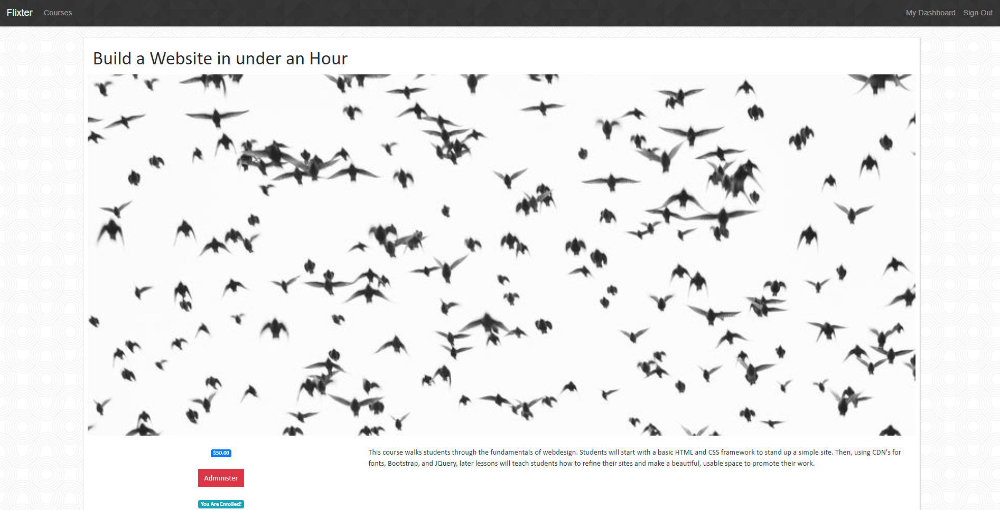
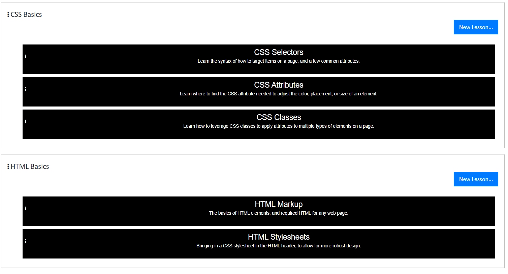
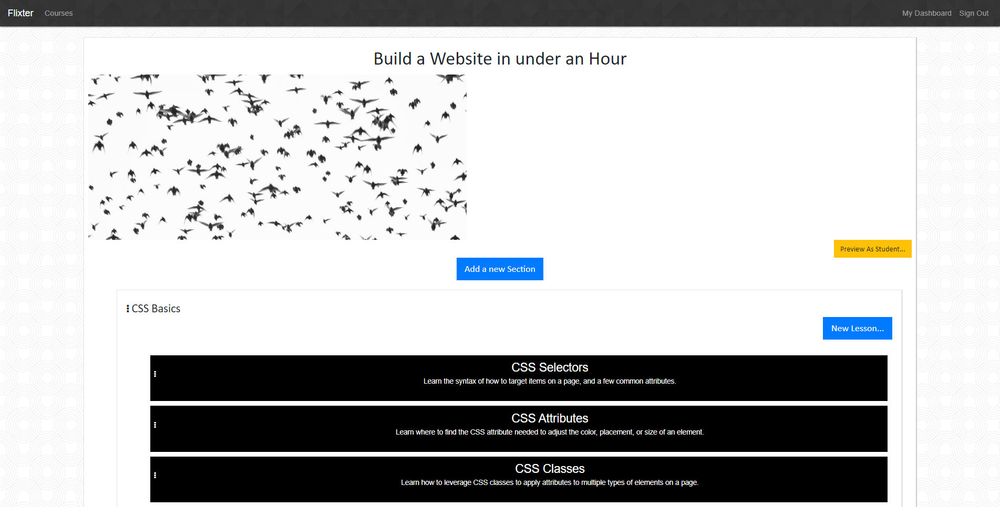

# Flixter

Flixter allows users to log in, create video curriculums, and enroll in other created curriculums.

This application was created as part of the University of Wisconsin Extension Bootcamp.

## User Stories

As an anonymous user, I want to:
  * See a complete list of courses so that I can find classes to enroll in
  * See the details of the course so that I can make an informed decision to enroll
  * Learn about the Flixter application so that I can assess its credibility

As an authenticated student user, I want to:
  * Enroll in courses so that I may learn the content
  * View the course videos so that I can learn
  * View a dashboard of all the courses I am enrolled in, so that I can keep on track with all of them
  * Make payments in system so that I can successfully enroll
  
As an authenticated instructor user, I want to:
  * Create courses so that I may market them to prospective students
  * Create sections so that I may organize the video lessons logically
  * Upload video lessons to the section so that students may view them
  * Upload a picture to the course so that students will be interested to learn more
  * Reorganize sections or lessons on the interface so that I can keep content in the correct order
  * View a dashboard of all the courses I have created, so that I can track them.
  * Edit courses, sections, or lessons as needed

## How to run the application:

### Production
Navigate to the production location of [Flixter](https://flixter-carrie-crow.herokuapp.com/)

#### All Users
1. To sign up, sign in, or log out, use the hyperlinks in the navigation bar:
  
2. All users are able to view a dashboard of all courses they are connected to by selecting "My Dashboard":
  
  

#### As a Student
1. To see a list of available courses to register for, select "Courses":
  
2. To view details of the selected course, select either "More Details", or the hyperlink of the course name:
  
3. From this page, you can enroll in a course, see the cost, and view available lessons if you are enrolled.
  

#### As an Instructor
1. To create a course, select "Teach a Course" in the application footer:
  
2. Fill in the appropriate fields for the course:
  
3. Create a section beneath that course, to begin organizing it:
  
4. Create lessons within the section, and upload videos of the lesson:
  
5. As an instructor, you are always able to administer the page. You can edit all levels, and you can drag and drop to reorganize them:
  

## High Level Specs
Flixter is a two-sided marketplace, allowing users to fill two roles: student, and instructor. Students can pay to view a course by creating an enrollment, which ties that student to the course. This provides access to all the connected sections and lessons. Instructors can create content for courses, sections, or lessons, and modify it later. The two roles are not mutually exclusive, and the user's role depends on whether they created a course, and/or whether they have an active enrollment.

Courses are comprised of sections, which contain lessons. Each course has many sections, each section has many lessons, and they are all traceable back to one section or course. Each of these models can only be updated by the instructor who created it, though they can be viewed by a student with an active enrollment.

### Application Specs
Flixter is a Ruby on Rails application, with a database is managed by PostgreSQL
* Rails v. 5.2.3
* Ruby v. 2.5.3

### Integrations Used

The following gems support Flixter's functionality:
* Devise, for user authentication
* Simple form, for managing user inputs
* Stripe, for managing user payments
* JQuery UI and Ranked Model, for reordering elements on the DOM
* Figaro, for controlling environment variables
* Carrierwave, for photo upload
* carrierwave-aws, for storing photos on Amazon Web Services
* Font-Awesome, for graphics
* Bootstrap, for page layout